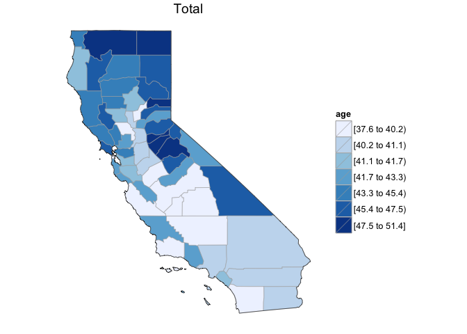
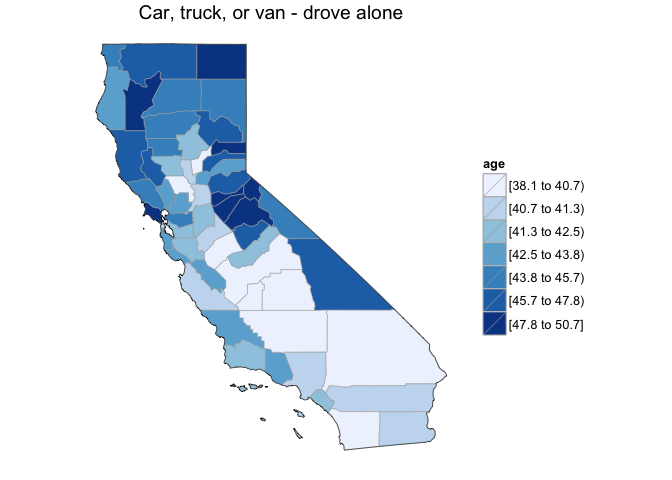
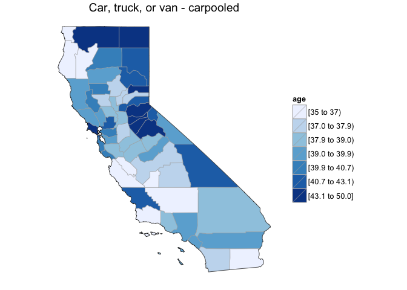
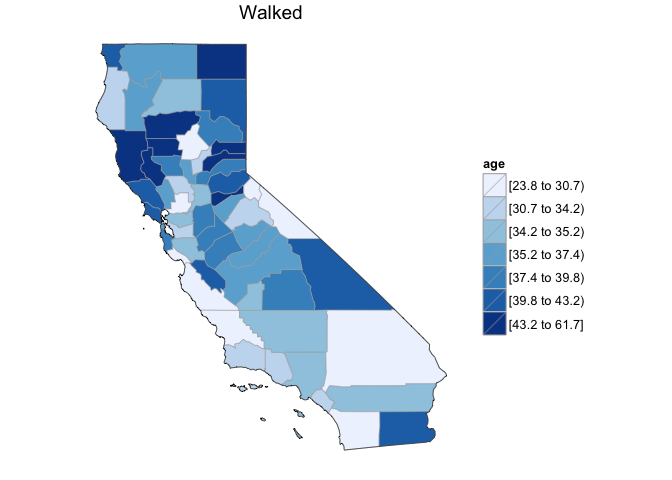
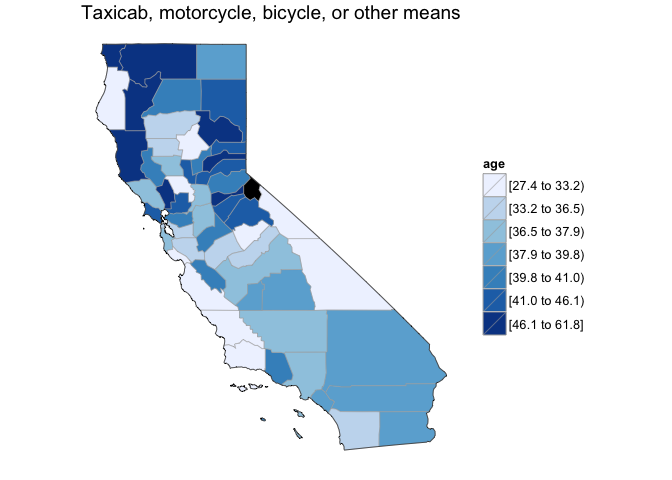
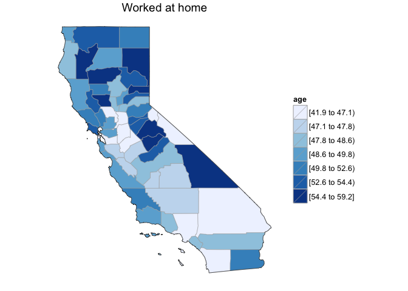
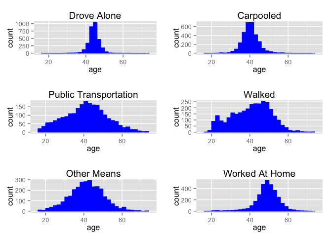

# Means of Transportation in California
David Clark  
December 4, 2015  

## Objective:
In California, how does the median age very depending on the mode of transportation?

### Load the required libraries:


```r
library(acs)
library(choroplethr)
library(ggplot2)
library(gridExtra)
```

### Load the data:

**Column Index Labels:**

1: Total

2: Car, truck, or van - drove alone

3: Car, truck, or van - carpooled

4: Public transportation (excluding taxicab)

5: Walked

6: Taxicab, motorcycle, bicycle, or other means

7: Worked at home


```r
df = get_acs_data("B08103", "county", endyear = 2012, span = 5, column_idx = 1)[[1]]
df.ages = data.frame(df$value)
names(df.ages) = c("total")
county_choropleth(df, state_zoom = "california", title = "Total", legend = "age")
```

 


```r
df = get_acs_data("B08103", "county", endyear = 2012, span = 5, column_idx = 2)[[1]]
df.ages$drove.alone = df$value
county_choropleth(df, state_zoom = "california", title = "Car, truck, or van - drove alone", legend = "age")
```

 


```r
df = get_acs_data("B08103", "county", endyear = 2012, span = 5, column_idx = 3)[[1]]
df.ages$carpooled = df$value
county_choropleth(df, state_zoom = "california", title = "Car, truck, or van - carpooled", legend = "age")
```

 


```r
df = get_acs_data("B08103", "county", endyear = 2012, span = 5, column_idx = 4)[[1]]
df.ages$public.transportation = df$value
county_choropleth(df, state_zoom = "california", title = "Public transportation (excluding taxicab)", legend = "age")
```

-1.png) 


```r
df = get_acs_data("B08103", "county", endyear = 2012, span = 5, column_idx = 5)[[1]]
df.ages$walked = df$value
county_choropleth(df, state_zoom = "california", title = "Walked", legend = "age")
```

 


```r
df = get_acs_data("B08103", "county", endyear = 2012, span = 5, column_idx = 6)[[1]]
df.ages$other.means = df$value
county_choropleth(df, state_zoom = "california", title = "Taxicab, motorcycle, bicycle, or other means", legend = "age")
```

 


```r
df = get_acs_data("B08103", "county", endyear = 2012, span = 5, column_idx = 7)[[1]]
df.ages$worked.at.home = df$value
county_choropleth(df, state_zoom = "california", title = "Worked at home", legend = "age")
```

 

## Median Age vs. Means of Transportation
A more interesting questions is, what is the relationship between median age and mode of transportation in California?


```r
plot.da = ggplot(aes(drove.alone), data=subset(df.ages, !is.na(drove.alone))) + 
  xlab("age") + ggtitle("Drove Alone") +
  geom_histogram(binwidth = 2, color="blue", fill="blue") +
  xlim(15,75)

plot.cp = ggplot(aes(carpooled), data=subset(df.ages, !is.na(carpooled))) + 
  xlab("age") + ggtitle("Carpooled") +
  geom_histogram(binwidth = 2, color="blue", fill="blue") + 
  xlim(15,75)

plot.pt = ggplot(aes(public.transportation), data=subset(df.ages, !is.na(public.transportation))) + 
  xlab("age") + ggtitle("Public Transportation") +
  geom_histogram(binwidth = 2, color="blue", fill="blue") + 
  xlim(15,75)

plot.w = ggplot(aes(walked), data=subset(df.ages, !is.na(walked))) + 
  xlab("age") + ggtitle("Walked") + 
  geom_histogram(binwidth = 2, color="blue", fill="blue") +
  xlim(15,75)

plot.om = ggplot(aes(other.means), data=subset(df.ages, !is.na(other.means))) + 
  xlab("age") + ggtitle("Other Means") +
  geom_histogram(binwidth = 2, color="blue", fill="blue") + 
  xlim(15,75)
  
plot.ah = ggplot(aes(worked.at.home), data=subset(df.ages, !is.na(worked.at.home))) + xlab("age") + ggtitle("Worked At Home") +
  geom_histogram(binwidth = 2, color="blue", fill="blue") + 
  xlim(15,75)
  
grid.arrange(plot.da, plot.cp, plot.pt, plot.w, plot.om, plot.ah, ncol = 2, nrow=3)
```

 

## Observations:
There is a wide spread in ages for those who use public transportation, walk, or go by taxicab, motorcycle, bicycle, or other means. Those that carpool range in age between 30 and 50, while those who drive alone have a slightly narrower range in ages, 40 to 50. Most people who work at home are between 40 and 60.


*Data taken from the [American Community Survey](http://factfinder.census.gov/faces/nav/jsf/pages/programs.xhtml?program=acs)*
